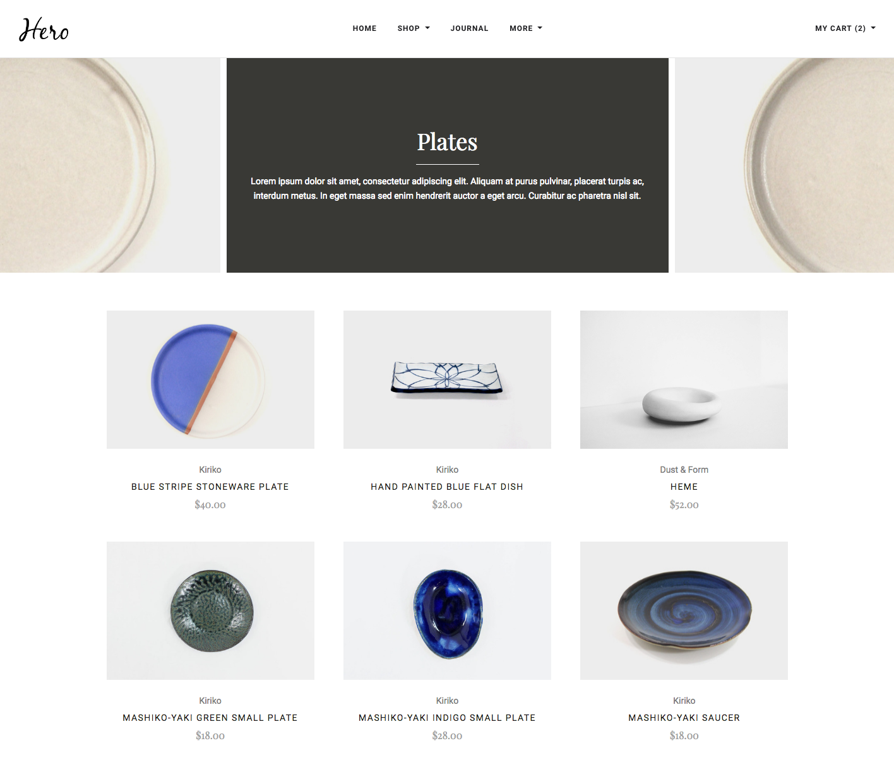
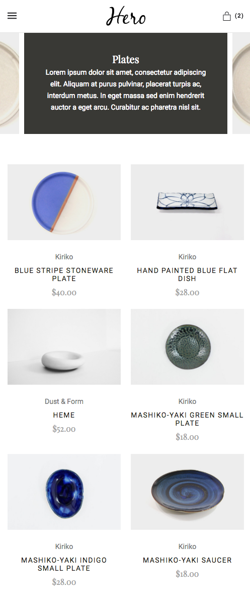
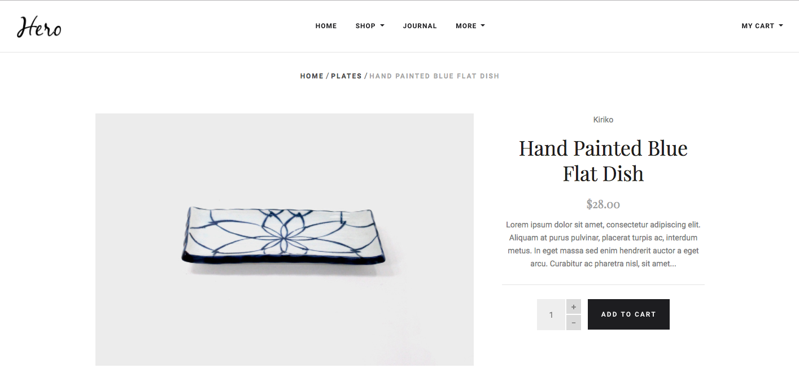
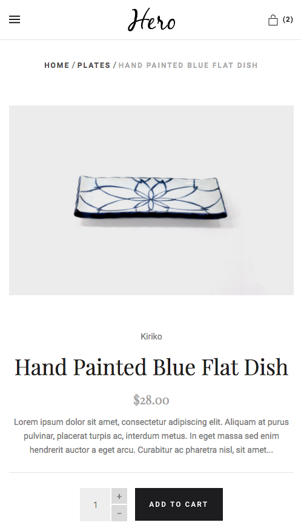
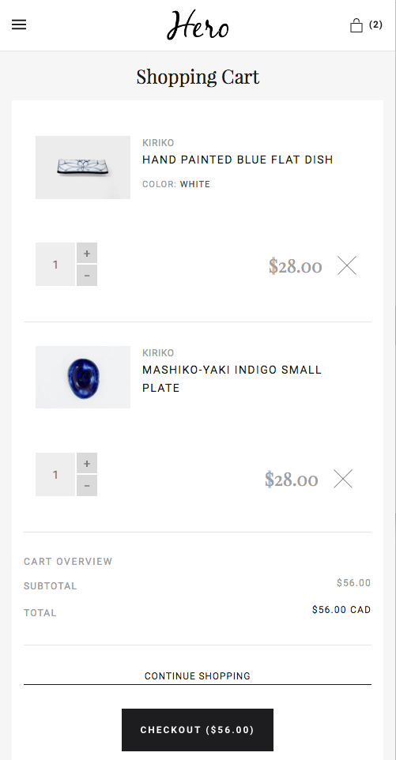

# Responsive Storefront

### Question
Using HTML, CSS and the supplied media, recreate the screens below in a responsive manner.
* The storefront consists of three main screens: a category list page, a product details page, and a cart page.
* None of the pages require any behaviour; they are completely static.
* You are free to create 3 separate static HTML files, or to use any tools/methods you deem appropriate to reduce code
  duplication.
* You are free to use whatever frameworks you deem appropriate, but you should justify your choice in the application's
  README.
* You are free to use any CSS pre/post processors, build tools or methodologies (SASS, LESS, Autoprefixer, PostCSS).
* You are free to nominate the breakpoint at which the page transitions from mobile to desktop layouts. Please justify
  your choices for each breakpoint in your code comments.
* Your assignment will be judged on structure, clarity of code, reusability and extensibility, accessibility, etc.

### Sample Screens
#### Category List page:

#### Product details page:

#### Cart page:

### Candidate Notes
You should
* Submit your assignment as a Git repository hosted on either GitHub or BitBucket.
* Take the full window of time; there are no bonuses for early submission.
* Include a README explaining how to install dependencies (if any) and build your site.
* Explain any compromises/shortcuts you made due to time considerations.

### Assessor Notes
The candidate
* May choose an appropriate CSS framework (Foundation, Bootstrap) or provide their own.
* Should demonstrate knowledge of CSS best practices (e.g. naming conventions, selector complexity, etc).
* Should demonstrate familiarity with NPM/Bower to obtain their chosen frameworks/tools.
* Should demonstrate separation of concerns in terms of reusable UI components, etc.
* Should demonstrate familiarity with their chosen CSS framework and build tools (e.g. mixins, variables, etc).

